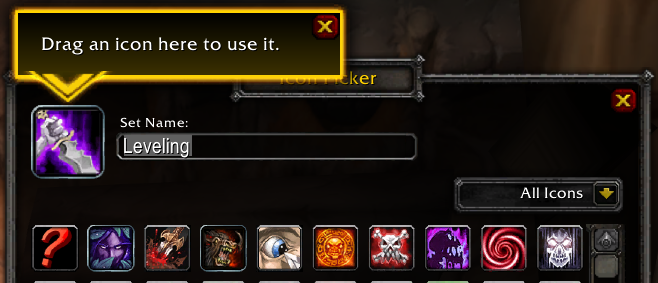
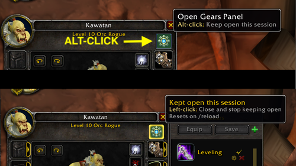

# Gears 
> A World of Warcraft Add-On

# **Your gear, your rules—instantly equipped.**

This addon provides a clean, efficient way to manage and switch equipment sets in World of Warcraft. It relies exclusively on Blizzard’s official WoW APIs to store and restore equipment sets safely, ensuring your configurations persist reliably across sessions.


Designed to be lightweight and performance-friendly, the addon focuses on fast, predictable set switching without unnecessary UI overhead. It integrates naturally with the game’s built-in equipment system, making it ideal for players who frequently change roles, specs, or encounter types—raiding, Mythic+, PvP, or solo play.

The goal is simplicity, stability, and trust: no bloated features, no fragile hacks—just a dependable equipment set manager built on supported WoW APIs.

## What's New

### **Drag and drop Icon from anywhere**
>_A LibIconPicker Update_

Set an icon without searching the grid: drag an item from your bags, a spell from your spellbook, or a macro, mount, battle pet, or equipment set onto the selected icon, then click **Okay**. The selected icon highlights while you hold something it accepts, and a one-time tip points it out the first time the picker opens. Addons that use LibIconPicker get this automatically, with no API changes.



### **Alt-click Gears button to keep the panel open this session**

If you swap gear often, reopening Gears every time you press **C** gets tedious. **Alt-click** the Gears button and it stays open for the whole session. The button glows **gold** so you know it's on. Click it normally to close the panel and go back to the default behavior. It also resets on `/reload`.



### Console Commands

Type `/gears` in chat to see the list of available commands:

```
/gears info                    - displays the addon info
/gears equip <index-or-name>   - equips the named or indexed equipment set
/gears status                  - shows the currently equipped set, if any
/gears list                    - lists all equipment sets
/gears options                 - opens the Gears options panel (requires Gears-OptionsUI)
```

Type `/gears-options` to configure Gears directly from the command line. Both `/gears options` and `/gears-options` require the **Gears-OptionsUI** companion addon to be enabled.

Examples:
```
# Toggles state
/gears-options general announceEquip

# Enables state
/gears-options general announceEquip on

# Disables state
/gears-options general announceEquip off
```

### Donations

If Gears has made your gameplay easier, consider supporting its development:

- **[Paypal&trade; Donation](https://www.paypal.com/donate/?hosted_button_id=AX58YP3GSGXVU)**
- **[Bitcoin Donation](https://www.blockchain.com/btc/address/3QQVAwJGkKHMM2oq6CLVWYgfx83TFVwp39)**

## About

- About the Author [(Tony Lagnada)](https://tony.resume.lagnada.com/)
- My AddOn Portfolio Can Be Found Here [Curse Forge/Kapresoft](https://www.curseforge.com/members/kapresoft/projects)
